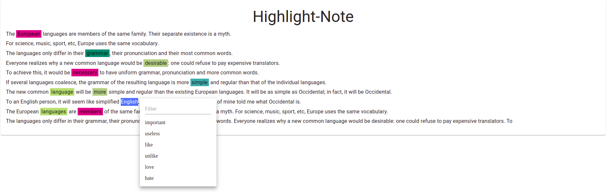

# Highlight Note

### How to use
- select word you want add highlight (by dragging or double click)
- then select category(mark)
- then you can see highlighted word in the text
- you can test highlight note in [demo Page](https://hellosamuel.github.io/highlight-note/)

##### Used libraries
- ReactJS
- Material-UI
- color-hash

##### Todo
- add new text
- add new category(mark)
- edit highlight word
- delete highlight word