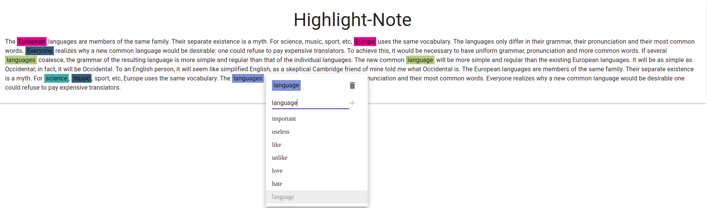

# Highlight Note

### How to use
- select word you want add highlight (by dragging or double click)
- then select category(mark)
- then you can see highlighted word in the text
- visit [here!](https://hellosamuel.github.io/highlight-note/) and enjoy :)

##### Used libraries
- ReactJS
- Material-UI
- color-hash

##### Environment
- Node v12.13.1
- ES6